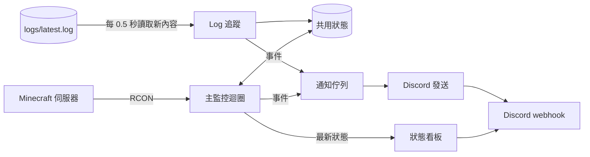
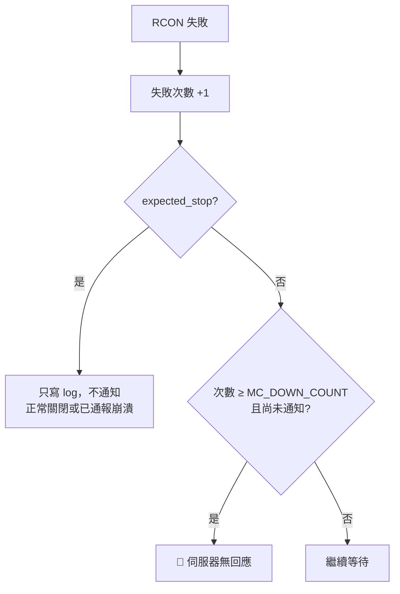

# 運作原理

## 架構

每個實例是一個 Python 程序，裡面有四個執行緒：



| 執行緒 | 工作 |
|---|---|
| Log 追蹤 | 讀取 log 新增的行，判斷玩家進出、啟動、關閉、崩潰 |
| 主監控迴圈 | 定期用 RCON 查詢 TPS、檢查存活，定期產生狀態看板內容 |
| Discord 發送 | 依序發送通知，處理速率限制 |
| 狀態看板 | 只保留最新一份內容，發送或編輯看板訊息 |

之所以需要 log 和 RCON 兩個來源：log 能即時得知事件，但不包含 TPS，也無法得知程序被強制結束；RCON 能查 TPS、能發現卡死，但伺服器不會主動推送事件。

---

## Log 追蹤

做法跟 `tail -F` 一樣：啟動時跳到檔案結尾（不處理舊內容），之後每 0.5 秒讀取新增的內容，逐行比對：

| 比對內容 | 事件 |
|---|---|
| `]: Steve joined the game` | 玩家加入 |
| `]: Steve left the game` | 玩家離開 |
| `]: Starting minecraft server version 1.20.1` | 開始啟動（記錄版本） |
| `]: Done (12.3s)!` | 啟動完成 |
| `]: Stopping server` | 正在關閉 |
| `This crash report has been saved to: ...` | 崩潰 |
| `Considering it to be crashed` | Watchdog 判定卡死 |

Forge 與原版的 log 前綴不同，但都以 `]: ` 接訊息內容，所以同一組規則兩邊都適用：

```
[15Sep2026 10:00:00.000] [Server thread/INFO] [minecraft/MinecraftServer]: Steve joined the game
[10:00:00] [Server thread/INFO]: Steve joined the game
```

### 防止聊天誤判

規則要求 `]: ` 後面**直接**是 3～16 個字元的玩家名稱（英數字與底線）。聊天訊息的格式是 `]: <Steve> ...`，開頭多了 `<`，所以玩家在聊天打「Bob joined the game」不會觸發通知。

### Log 輪替

伺服器重啟時，舊的 `latest.log` 會被壓縮成 `日期-n.log.gz`，再建立新的 `latest.log`。程式每次沒讀到新內容時會比對：

- 檔案的 inode 是否改變（被換成新檔案）
- 檔案大小是否比目前讀取位置小（被清空）

任一成立就重新開啟檔案，並**從頭**讀取，確保新 log 開頭的 `Starting` 等訊息不會漏掉。

檔案以二進位方式讀取並自行切行，沒有換行結尾的半行會留到下次再處理。

---

## RCON 輪詢

主監控迴圈每 `MC_POLL_INTERVAL` 秒透過 RCON 執行一次 `MC_TPS_COMMAND`（留空時改用 `list`）。

- **維持長連線**：每次重新連線，伺服器都會在 log 記錄 `RCON Client started`，長連線可以避免洗版。
- **指令結果不會寫進伺服器 log**，所以輪詢不會汙染 log。
- **能偵測卡死**：RCON 收到的指令會交給伺服器主執行緒執行。主執行緒卡住時不會回應，10 秒後逾時，算一次失敗。

RCON 協定的細節見 [RCON](rcon.md)。

### TPS 解析

RCON 回應中，各訊息之間**沒有換行**，而且沒有 log 前綴：

```
Dim minecraft:overworld (...): Mean tick time: 57.739 ms. Mean TPS: 17.319Dim twilightforest:...: Mean TPS: 20.000 ... Overall: Mean tick time: 61.063 ms. Mean TPS: 16.376
```

解析步驟：

1. 移除顏色代碼（`§` 加一個字元）
2. 找到**最後一個** `Overall`，只取之後的文字，前面各維度的數值全部略過
3. 在這段文字裡找：
   - `Mean TPS: 數字`（Forge）或 `數字 TPS`（NeoForge）→ TPS
   - 第一個 `數字 ms` → MSPT
4. 找不到 `Overall` 時，改找原版 `tick query` 的 `time per tick: 數字ms`，換算 TPS = min(20, 1000 ÷ MSPT)

數字允許用逗號當小數點，因為 Forge 依 JVM 語系格式化數字，某些語系（德文、法文等）會輸出 `16,376`。

### TPS 警報

```
TPS < 門檻 → 計數 +1 → 達到 MC_LOW_TPS_COUNT 且尚未通知 → 🐢 TPS 持續過低
TPS ≥ 門檻 → 計數歸零 → 若先前有通知 → 👍 TPS 已恢復
```

一次過低事件只通知一次，恢復時再通知一次。TPS 在門檻附近上下跳動時不會連續洗版。RCON 失敗時計數也會歸零。

---

## 崩潰與無回應判斷

核心是共用狀態中的 `expected_stop`（預期中的關閉）：

| 事件 | `expected_stop` | 其他狀態 |
|---|---|---|
| `Starting minecraft server` | 設為 true | 啟動階段，RCON 還沒開 |
| `Done (...)!` | 設為 false | 啟動世代 +1，清除崩潰標記 |
| `Stopping server` | 設為 true | |
| crash report / watchdog | 設為 true | 標記已崩潰 |

主監控迴圈在 RCON 失敗時：



這樣可以區分三種情況：

| 情況 | log 內容 | 結果 |
|---|---|---|
| 正常關閉 | `Stopping server` | ⏹️ 正在關閉，之後 RCON 斷線不通知 |
| Java 例外崩潰、watchdog 卡死 | crash report | 💥 崩潰，之後的 `Stopping server` 和 RCON 斷線都不重複通知 |
| `kill -9`、OOM killer、JVM 本身崩潰 | 沒有任何紀錄 | 🔴 無回應 |

### 啟動世代

每次 `Done` 時啟動世代 +1。主監控迴圈發現世代改變時，會把失敗次數歸零。

原因：`Done` 出現後，RCON 要再過一小段時間才會開始監聽。如果不歸零，伺服器停機期間累積的失敗次數，會讓剛啟動的伺服器立刻被誤判為無回應。歸零後需要重新累積 `MC_DOWN_COUNT` 次失敗才會通知。

同理，若先前發過「無回應」，重新啟動後只會發「✅ 已啟動」，不會再多發一則「恢復回應」。

### Watchdog 與 crash report 合併

Watchdog 判定卡死時，log 會先出現 `Considering it to be crashed`，接著才寫出 crash report。程式收到前者時會先等待 5 秒：

- 等到 `crash report has been saved to` → 合併成一則通知，附上檔案
- 沒等到 → 單獨發送卡死通知

### Crash report 摘要

從 crash report 擷取：

- `Description:` 那一行 → 「描述」欄位
- 描述之後的例外訊息與前幾行 stack trace（最多 6 行）→ 「例外」欄位

報告中的相對路徑會以 `MC_SERVER_DIR` 為基準解析。

---

## 狀態看板

看板是**一則被持續編輯的訊息**，而不是一直發新訊息。

1. 第一次以 `?wait=true` 發送，取得訊息 ID
2. 訊息 ID 與 webhook 網址的雜湊值存到 `STATE_DIR/status_board.json`（不存 token）
3. 之後以 `PATCH /messages/{id}` 編輯
4. 程式重啟時讀取紀錄，webhook 相同就繼續編輯同一則
5. 編輯時收到 404（訊息被刪除）→ 重新建立

看板更新由獨立執行緒負責，只保留最新的一份內容。Discord 回應變慢時不會堆積請求，也不會拖慢主監控迴圈。

### 看板狀態

| 顯示 | 條件 |
|---|---|
| 🟢 運作中 | 最近一次 RCON 查詢成功 |
| 🟡 啟動中 | log 出現 `Starting`，還沒 `Done` |
| ⏹️ 已關閉 | log 出現 `Stopping server` |
| 💥 已崩潰 | 偵測到崩潰，還沒重新啟動 |
| 🔴 無回應 | RCON 失敗次數達到門檻 |
| 🟡 連線異常 | RCON 失敗，但還沒達到門檻 |
| ⚫ 監控程式已停止 | mc-notify 收到 SIGTERM（例如 `systemctl stop`） |

描述中的「最後更新 X 分鐘前」使用 Discord 的動態時間戳（`<t:時間:R>`），每個人看到的都是相對於現在的時間。如果 mc-notify 本身掛掉，這個時間就會停止更新。

---

## Discord 發送

- 所有通知進入佇列，由單一執行緒依序發送
- 收到 HTTP 429（速率限制）時，依回應中的 `retry_after` 等待後重試，最多 5 次
- 連線錯誤時等待 5 秒重試
- 自訂 `User-Agent`，因為 Discord 有時會拒絕 Python 預設的 User-Agent
- `allowed_mentions` 預設為空，只有設定 ping 的事件才允許提及指定的身分組
- 有附件時使用 `multipart/form-data`，訊息內容放在 `payload_json` 欄位

## 停止時的行為

收到 SIGTERM 時：

1. 最多等 5 秒，讓佇列中的通知送完
2. 把狀態看板更新為「⚫ 監控程式已停止」
3. 結束

---

## 已知限制

- **程式啟動時伺服器是關著的**：因為沒有看到 `Stopping server`，會發一次「無回應」。
- **100 tick 平均**：Forge 與原版的平均值只涵蓋最近約 5 秒，查詢之間的短暫卡頓看不到。
- **非同步指令**：透過 RCON 拿不到非同步指令（例如 Spark）的輸出。
- **log 格式被模組改變**：若有模組改寫了玩家進出訊息的格式，玩家通知會失效，其他功能不受影響。
- **watchdog 超過 5 秒才寫出 crash report**：卡死通知會先單獨發出，不會附上檔案。
