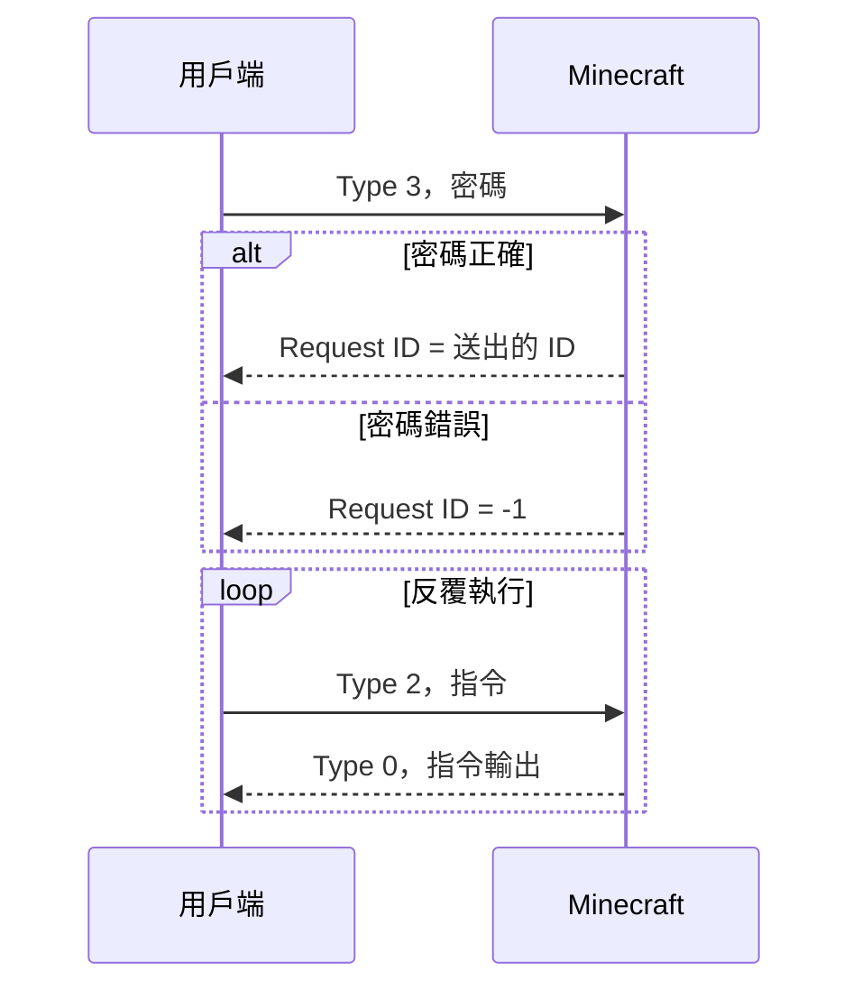

# RCON

RCON（Remote Console）是 Minecraft Java 伺服器內建的遠端控制台協定，源自 Valve 的 Source RCON。它走 TCP，預設 port 是 25575。

**本質上就是「遠端在伺服器控制台打指令，並拿回輸出文字」。**

## 開啟方式

`server.properties`：

```properties
enable-rcon=true
rcon.port=25575
rcon.password=一組長的隨機密碼
broadcast-rcon-to-ops=false
```

| 設定 | 說明 |
|---|---|
| `enable-rcon` | 開關 |
| `rcon.port` | 監聽的 port，多個伺服器要錯開 |
| `rcon.password` | 密碼，空白時 RCON 不會啟動 |
| `broadcast-rcon-to-ops` | 是否把 RCON 執行的指令廣播給線上的 OP。mc-notify 每 30 秒查詢一次，不關掉的話 OP 會一直看到訊息 |

## 封包格式

每個封包的欄位如下，整數都是 little-endian：

| 欄位 | 大小 | 說明 |
|---|---|---|
| Length | 4 bytes | 後面所有內容的長度 |
| Request ID | 4 bytes | 用戶端自訂，回應會帶回同一個 ID |
| Type | 4 bytes | `3` = 登入，`2` = 執行指令，`0` = 回應 |
| Payload | 不定 | 密碼或指令文字（UTF-8），以 `\0` 結尾 |
| Padding | 1 byte | 再一個 `\0` |

用 Python 組封包：

```python
data = struct.pack("<ii", request_id, packet_type) + body.encode("utf-8") + b"\x00\x00"
packet = struct.pack("<i", len(data)) + data
```

## 連線流程



登入成功後，同一條連線可以一直下指令。mc-notify 就是維持一條長連線，每次查詢只送一個 Type 2 封包。

## 能做什麼

伺服器控制台能打的指令，RCON 都能執行，而且擁有控制台的最高權限（permission level 4）。

| 用途 | 指令範例 |
|---|---|
| 查詢 | `list`、`forge tps`、`tick query`、`seed` |
| 玩家管理 | `kick`、`ban`、`pardon`、`whitelist add`、`op` |
| 維運 | `save-all`、`save-off`、`save-on`、`stop` |
| 公告 | `say`、`tellraw` |
| 遊戲操作 | `time set`、`weather`、`give`、`gamerule` |
| 模組指令 | 只要控制台能用，例如各種管理類模組 |

常見的應用：

- **備份**：備份前 `save-off` + `save-all flush`，備份完 `save-on`，避免備份到寫到一半的區塊
- **排程重啟**：重啟前用 `say` 倒數提醒玩家
- **監控**：定期查詢 TPS 與線上人數（mc-notify 的做法）
- **Discord bot**：在 Discord 下指令，轉發給伺服器

### 手動操作工具

- [mcrcon](https://github.com/Tiiffi/mcrcon)：C 寫的命令列工具，Ubuntu 可以 `apt install mcrcon`（依版本可能需要自行編譯）
- [rcon-cli](https://github.com/itzg/rcon-cli)：Go 寫的單一執行檔

```bash
mcrcon -H 127.0.0.1 -P 25575 -p '密碼' "list"
mcrcon -H 127.0.0.1 -P 25575 -p '密碼' -t    # 互動模式
```

注意密碼會出現在指令歷史與程序列表中，正式使用時請改用環境變數或設定檔。

## 限制

- **沒有加密**：密碼與指令都是明文，**絕對不要對外開放 RCON port**。只從本機連線，或透過 SSH tunnel：
  ```bash
  ssh -L 25575:127.0.0.1:25575 使用者@伺服器
  ```
- **只能問答，不能推送**：伺服器不會主動通知任何事件，所以 mc-notify 還需要追蹤 log。
- **拿不到非同步輸出**：非同步執行的指令（例如 Spark），輸出是在 RCON 回應送出之後才產生的，會拿到空字串。
- **訊息之間沒有換行**：同一個指令產生多則訊息時，RCON 回應會把它們直接接在一起。
- **回應大小有限**：單一回應封包約 4096 bytes，更長的輸出會分成多個封包，簡單的用戶端可能只讀到第一段。mc-notify 用到的指令輸出都遠小於這個大小。
- **沒有成功或失敗的狀態碼**：只能解析文字判斷。
- **指令在主執行緒執行**：伺服器卡住時，RCON 指令也會卡住。這是限制，但 mc-notify 正好利用這點來偵測卡死。

## 防火牆

確認 RCON port 沒有對外開放：

```bash
sudo ss -tlnp | grep 25575     # 查看監聽位址
sudo ufw status                # 確認沒有允許 25575
```

Minecraft 的 RCON 會監聽 `server-ip` 設定的位址（留空時是所有介面），所以要靠防火牆擋住外部連線。
